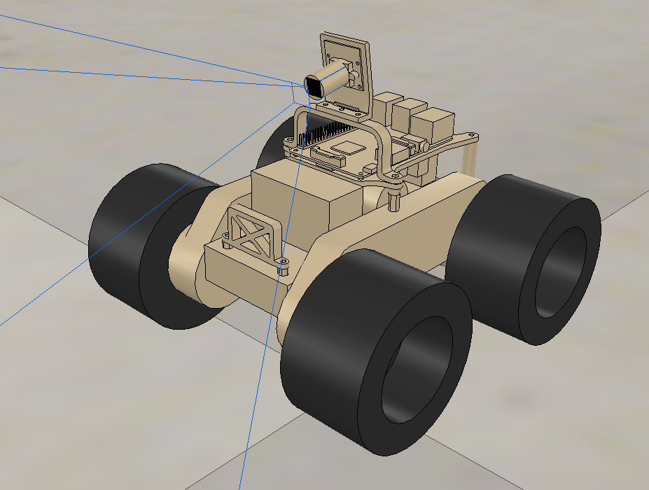
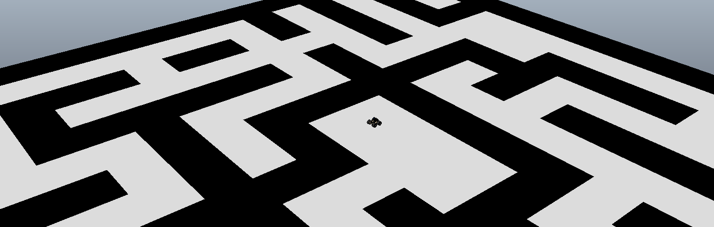
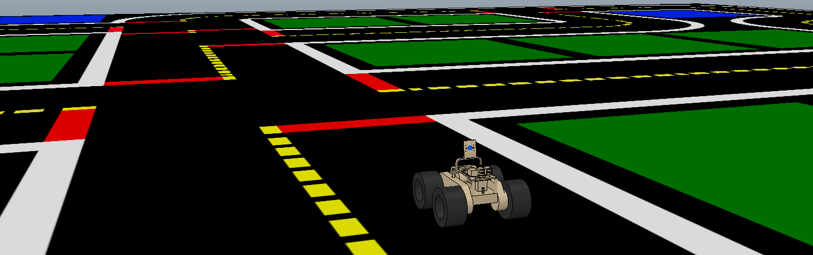

# Advanced Teleoperated Office Marauder (ATOM)

## Overview

Repository for the ATOM differential mobile platform running on a Raspberry Pi and its simulation stack in [V-REP](http://www.coppeliarobotics.com), based on [ROS framework](http://www.ros.org/).

**Keywords:** raspberry pi, robot, hardware, simulation, mobile platform, v-rep

### License

The source code is released under [MIT license](LICENSE).

**Author(s): Karl Kangur  
Maintainer: Karl Kangur, karl.kangur@gmail.com  
Affiliation: Personal**

The `atom` package has been tested under [ROS](http://wiki.ros.org) Kinetic and [Ubuntu Mate](https://ubuntu-mate.org/raspberry-pi/) 16.04 on a Raspberry Pi and Ubuntu 16.04 with V-REP 3.5.0 (rev. 6) for simulation.

## Installation

### Building from Source

#### Dependencies

    sudo apt install -y ros-kinetic-robot-state-publisher
    sudo apt install -y ros-kinetic-ros-control
    sudo apt install -y ros-kinetic-ros-controllers
    sudo apt install -y ros-kinetic-diff-drive-controller
    sudo apt install -y ros-kinetic-cv-camera
    sudo apt install -y ros-kinetic-joy
    sudo apt install -y ros-kinetic-teleop-twist-joy
    sudo apt install -y ros-kinetic-map-server
    sudo apt install -y ros-kinetic-move-base

#### Building

To build from source, clone the latest version from this repository into your catkin workspace and compile the package using

    mkdir -p ~/catkin_ws/src
    cd ~/catkin_ws/src
    git clone https://github.com/Nurgak/atom.git
    catkin build

For the ROS/V-REP interface to work the `VREP_ROOT` global variable must be defined, it must point to the V-REP folder, one can add `export VREP_ROOT="/home/.../V-REP_..."` to `~/.bashrc`

### Unit Tests

No unit tests so far.

## Usage

Run the main node on the Raspberry Pi with

    roslaunch atom_interface_hardware atom_interface_hardware.launch

Run the V-REP simulation with

    roslaunch atom_interface_vrep atom_interface_vrep.launch map:=maze
    roslaunch atom_interface_vrep atom_interface_vrep.launch map:=duckietown

This will start the simulation interface as well as `move_base` and R-VIZ visualization. The `map` argument loads the relevant costmap `.yaml` file from the `map` folder.

Note that `roscore` must be launched first, then V-REP started, the scene loaded and the simulation running. The V-REP scenes are located in `atom_interface_vrep/scene`.

### Maze

The maze scene is meant to showcase the `move_base` node usage to find a traversable path and then navigate it accurately. The goal position is set in R-VIZ.

### Duckietown

The duckietown scene places ATOM in a [duckietown](https://www.duckietown.org) environment with roads. This is a work in progress where ATOM will eventually be able to navigate roads. Currently it can be used similarly to the maze scene where it navigates only on accessible areas. The map is generated with a custom script under `atom_interface_vrep/map/duckietown_map_generator`.

## Config files

### atom_control/config

* **atom_controllers.yaml** The joint state controller and the differential drive controller parameters for the ATOM platform.
* **base_local_planner_params.yaml** Parameters for the local planner, used with `move_base` package.
* **costmap_common_params.yaml** Common parameters for the local and global planners, used with `move_base` package.
* **global_costmap_params.yaml** Parameters specific for the global planner, used with `move_base` package.
* **local_costmap_params.yaml** Parameters specific for the local planner, used with `move_base` package.

## Launch files

* **atom_interface_hardware.launch:** launch the hardware interface, sends PWM signals to the H-brige connected to the Raspberry Pi to se wheel speeds.
* **atom_interface_vrep.launch:** launch the simulation interface with R-VIZ visualization and `move_base` node.
* **atom_interface_gazebo.launch:** launch the simulation interface with R-VIZ visualization and `move_base` node.
* **atom_ground_control.launch:** launch the R-VIZ visualization with joystick interface, meant to be used on remote computer with the physical platform being the master.

## Nodes

### atom_interface_hardware

Hardware interface between the Raspberry Pi and the mobile platform. It creates the controller manager and exposes the velocity joint interfaces for the left and right drive motors. The joint definitions are taken from the `diff_drive_controller`, so they only need be defined once in the controller configuration file.

This node sets the PWM signals of the GPIO to set the motor speeds through the L298 dual h-bridge module, according to the joint velocity commands received by `diff_drive_controller`.

The pins of the L298 are to be connected the following way:

| L298 | RPi      |
| ---- | -------- |
| EN1  | GPIO5    |
| EN2  | GPIO6    |
| EN3  | GPIO13   |
| EN4  | GPIO19   |

#### Parameters

* **`diff_drive_controller/left_wheel`** (array, default: [])

	Left wheel names.

* **`diff_drive_controller/right_wheel`** (array, default: [])

	Right wheel names.

* **`diff_drive_controller/publish_rate`** (float, default: 10Hz)

	Control loop rate.

### atom_interface_vrep

Node to interface with the V-REP simulation. The names of the joints in the V-REP simulation must agree with the joint names defined in the `diff_drive_controller` configuration.

* **`diff_drive_controller/left_wheel`** (array, default: [])

	Left wheel names.

* **`diff_drive_controller/right_wheel`** (array, default: [])

	Right wheel names.

* **`diff_drive_controller/publish_rate`** (float, default: 10Hz)

  Control loop rate.
